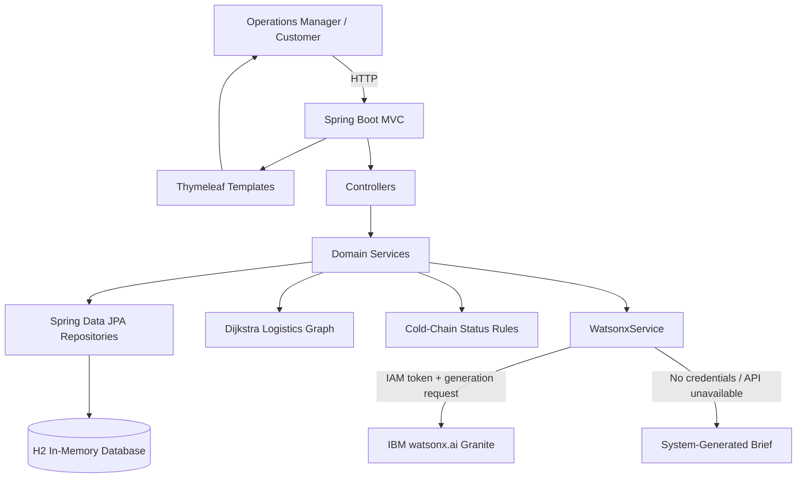

# Architecture

## System Architecture

The deployed application is a server-rendered Spring Boot MVC application.
Thymeleaf renders the dashboard pages, while services query the H2 data store
and calculate disruption impact, route alternatives, fleet availability, and
cold-chain status. The AI brief optionally calls IBM watsonx.ai through
`WebClient`; when credentials are unavailable, the application generates a
system brief from the same live application statistics.

## Components

| Component | Technology | Responsibility |
|---|---|---|
| Web UI | Thymeleaf, HTML, CSS | Dashboard, disruptions, reroute impact, idle fleet, cold-chain, tracking, and AI brief pages |
| Web application | Spring Boot 3.3, Spring MVC | Routes requests, prepares view models, and handles reroute approval |
| Persistence | Spring Data JPA + H2 | Stores seeded routes, shipments, disruptions, fleet assets, and temperature readings |
| Disruption logic | `DisruptionService` | Matches an event's affected segment against shipment route segments |
| Route optimization | Custom Dijkstra graph | Finds a shortest available bypass and recommends a compatible carrier |
| Cold-chain monitoring | `ColdChainService` | Reads the latest temperature and classifies Normal, Minor Breach, or Major Breach |
| AI integration | `WatsonxService`, Spring WebClient | Sends operational statistics to IBM Granite and returns a plain-English brief |
| Local AI fallback | Ollama-compatible endpoint | Optional local Granite generation when configured |

## Seeded Demo Data

On an empty database, `DataSeeder` creates:

- 6 Indian freight routes, including Mumbai–Delhi, Chennai–Pune,
  Kolkata–Mumbai, Delhi–Bangalore, and Ahmedabad–Kochi.
- 4 disruptions: NH48 weather flooding, Mumbai Port strike, Delhi Hub
  geopolitical restrictions, and Nagpur Crossing fog.
- 18 shipments across the routes, including pharmaceuticals, vaccines,
  perishables, electronics, textiles, FMCG, and machinery.
- 9 assets: trucks, containers, and vessels, with idle and in-use status.
- 21 temperature readings for 7 cold-chain shipments.

The seed runs only when route and shipment tables are empty. In the deployed
demo, this data is therefore representative application data rather than a
connection to an external carrier or sensor feed.

## Data Flow

1. A browser requests a page such as `/dashboard`, `/disruptions`,
   `/fleet/idle`, `/coldchain`, `/track`, or `/ops-brief`.
2. The controller reads entities through Spring Data repositories and passes
   view data to the matching Thymeleaf template.
3. For a disruption impact page, `DisruptionService` finds shipments whose
   route contains the affected segment.
4. `RouteOptimizationService` removes the blocked segment or node from its
   in-memory Indian logistics graph and runs Dijkstra's algorithm to find an
   alternate path.
5. `ColdChainService` selects each shipment's latest reading and compares it
   with the 2–8 °C target range.
6. The AI Operations Brief aggregates shipment, disruption, idle-fleet, and
   cold-chain counts. `WatsonxService` sends those statistics to Granite when
   configured, otherwise it returns a clearly identified system-generated
   brief.
7. When a dispatcher approves a successful reroute, the shipment is saved as
   `IN_TRANSIT (REROUTED)` and its current location records the bypass.

## Security Considerations

- IBM API keys and watsonx project identifiers are read from environment
  variables and are not stored in the repository.
- The default configuration contains an empty API key, so credentials are not
  required to run the demo locally.
- The application does not expose raw database credentials or AI tokens in
  rendered pages.
- The current hackathon demo does not include authentication or role-based
  access control; production deployment should add both before exposing
  shipment and operational controls.

## Scalability Notes

The controllers and services can be deployed statelessly behind a load
balancer after moving persistence from H2 to a shared database. The in-memory
route graph can be loaded from a managed network service, while shipment and
sensor data can arrive through authenticated event ingestion. For production,
watsonx requests should use timeouts, rate limits, retries with backoff, and
queueing so a slow AI response never blocks core tracking or rerouting
operations.
